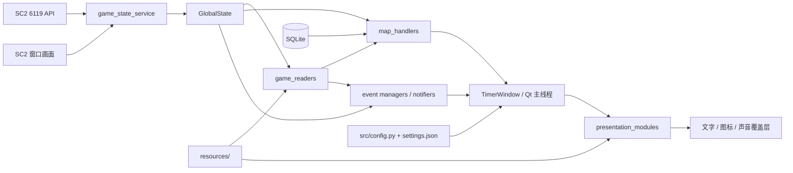

# KeiFrame 架构

本文描述当前源码的运行时架构、数据流、线程模型和扩展边界。产品目标与术语见 [`context.md`](context.md)，代理工作规范见 [`AGENTS.md`](AGENTS.md)。

## 1. 总览

KeiFrame 采用“共享游戏事实 + 主线程调度 + 专用识别器/状态机 + 覆盖层展示”的桌面应用结构。



核心原则是：

- `game_state_service` 产生事实，不决定如何展示。
- `game_readers` 识别画面，不推进 Qt 界面。
- `map_handlers` 和提醒管理器决定何时触发。
- `presentation_modules` 只负责把结果显示或播放出来。
- `TimerWindow` 是装配中心，不应成为所有业务算法的容器。

## 2. 启动顺序

入口为 `python -m src.main`：

1. `src/main.py` 解析项目根目录。
2. 在导入主要 PyQt UI 模块之前配置 Windows DPI awareness 与 Qt 固定物理像素环境变量。
3. 设置 Qt 的高 DPI、原生对话框和原生控件相关属性。
4. 配置日志、加载主 UI 字体并创建 `QApplication`。
5. 创建 `TimerWindow`；装配时只尝试一次加载可选的 OpenCV DNN PP-OCRv5 addon。
6. `TimerWindow` 打开地图和突变数据库连接，加载 `settings.json` 覆盖配置。
7. 装配 UI、Toast、地图分支解析器、识别器、倒计时、神器和补给提醒。
8. 注册全局快捷键、创建托盘与控制窗。
9. 启动后台游戏状态线程，并由 Qt 定时器每 200 ms 调用 `game_time_handler.update_game_time()`。
10. 加载地图列表中的第一张地图并显示置顶主窗口。

DPI 初始化顺序不可随意改变。主 UI 模块过早导入 PyQt，可能导致 Windows 缩放和坐标基准不一致。

## 3. 线程与调度模型

| 执行上下文 | 创建位置 | 主要职责 | 与 UI 的交互 |
| --- | --- | --- | --- |
| Qt 主线程 | `src/main.py` | 窗口、表格、定时分发、状态机更新和展示 | 直接操作 Qt 控件 |
| 游戏检查线程 | `TimerWindow._run_async_game_scheduler()` | 运行 asyncio 循环、轮询 6119、调度截图 | 通过 `progress_signal` 通知主线程 |
| 截图 asyncio task | `game_state_service.check_for_new_game_scheduler()` | 约每 0.1 秒捕获活动 SC2 窗口并更新共享截图 | 只写 `GlobalState`，使用锁 |
| 突变/种族识别线程 | `Mutator_and_enemy_race_recognizer` | 从共享截图识别敌方种族和突变图标 | 通过 Qt signal 返回结果 |
| 敌方组成被动更新 | 复用 `Mutator_and_enemy_race_recognizer` 的 perception loop | 使用锁内复制、锁外处理的最新截图执行 tooltip 检测、OCR 和匹配 | 确认后写入 `GlobalState.enemy_composition`，再通过 Qt signal 交给主线程 notifier |
| 净网行动识别线程 | `MalwarfareMapHandler` | 识别颜色文字、倒计时、暂停和节点 | 主线程轮询其最新结构化数据 |
| 小地图红点 worker | `MinimapRedDotDetector` | 按监控规则分析共享截图 | `MapVariantAutoResolver` 查询结果并切图 |
| 死亡摇篮识别线程 | `CradleOfDeathMapHandler` | 识别倒计时并产生阶段事件 | 当前尚未由主窗口创建或消费 |

线程安全规则：

- `GlobalState.latest_screenshot`、时间戳和缩放信息在 `screenshot_lock` 下读写。
- 识别器应在锁内复制截图，随后释放锁再做耗时计算。
- `EnemyCompositionRecognizer` 是被动 update 组件，由已有视觉识别循环中的 `EnemyCompositionScheduler` 调用；它不创建自己的后台线程，且只在 tooltip 连续确认后执行 OCR。
- `EnemyCompositionScheduler` 只发出确认回调/Qt signal，不直接操作 `MessagePresenter`；`EnemyCompositionNotifier` 在 Qt 主线程拥有独立 presenter，按 catalog 和当前语言显示一次、持续 5 秒并在 reset/shutdown 时清理。
- 后台线程不能直接修改 Qt 控件。
- 退出时先设置 `state.app_closing`，再停止识别器和专用 handler，最后关闭数据库连接和 Qt 窗口。

## 4. 核心组件

### 4.1 进程与 UI 装配

`src/main.py`

- 初始化运行环境、日志、DPI 与字体。
- 创建 `QApplication` 和 `TimerWindow`。

`src/qt_gui.py`

- 维护 `TimerWindow` 及其 Qt 信号。
- 装配数据库、UI、识别器、地图管理器和各类提醒器。
- 响应 `update_map` 与 `reset_game_info`。
- 管理地图选择、快捷键转发、设置热更新和安全退出。

`src/ui_setup.py`、`src/ui/`

- 创建主窗口控件、表格、菜单、按钮和布局。
- `ui_setup.py` 还会创建 `MutatorManager`，因此它不只是纯布局文件。

### 4.2 游戏状态服务

`src/game_state_service.py` 包含单例 `GlobalState` 以及两个主要循环：

- `process_game_data()` 请求 `/game/` 和 `/ui/`，更新游戏时间、游戏 ID 和是否在局内；新游戏时尝试从玩家列表识别地图。
- `screenshot_scheduler()` 定位活动 SC2 窗口，用 `mss` 截图，转换成 BGR，并按宽度标准化到 1920 像素。

新游戏通过玩家列表的 JSON 哈希识别。检测到新局后，后台线程发出 `reset_game_info` 和可选的 `update_map` 信号，主线程负责清理与切换。

### 4.3 时间分发

`src/game_time_handler.py` 是主线程中的统一时间分发器：

- 格式化并更新游戏时间标签。
- 每个新的整数游戏秒检查突变、标准地图事件、地图版本、种族/突变识别进度、神器、补给和自定义倒计时。
- “净网行动”例外：其 OCR 数据刷新与游戏秒不同步，因此每次 Qt timer tick 都可处理最新倒计时。
- 使用 `_last_dispatch_game_second` 避免同一游戏秒重复执行普通逻辑。

### 4.4 地图层

`src/map_handlers/IdentifyMap.py`

- 根据玩家数量和特定槽位的多语言单位名识别地图。

`src/map_handlers/map_loader.py`

- 响应地图或版本选择。
- 从 `maps.db` 加载事件并填充表格。
- 为普通地图创建 `MapEventManager`。
- 为“净网行动”创建 `MapwarfareEventManager` 和 `MalwarfareMapHandler`。
- 处理 A/B、左/右、神/人虫版本按钮。

`src/map_handlers/map_event_manager.py`

- 比较当前游戏秒与表格中的地图事件。
- 标记过去和下一事件，滚动表格。
- 在配置的提前量内创建或移除 Toast。

`src/map_handlers/malwarfare_*`

- 从动态画面倒计时驱动“净网行动”节点事件，不依赖固定绝对游戏时间。

`src/map_handlers/map_variant_auto_resolver.py`

- 在特定游戏时间窗口启动小地图红点监控。
- 当前规则覆盖“往日神庙”A/B 与“虚空撕裂”左/右分支。
- 用户手动切换版本后，本局禁用自动分支，避免系统覆盖明确选择。

### 4.5 识别层

`src/game_readers/` 的主要组件：

- `mutator_and_enemy_race_recognizer.py`：模板匹配敌方种族和突变图标。
- `enemy_composition_recognizer.py`：在共享截图上检测敌方组成 tooltip，收集标题 crop 并通过 OCR/匹配确认 canonical English 名称；由 `TimerWindow` 装配，并由 `EnemyCompositionScheduler` 接入已有视觉识别循环。
- `enemy_composition_catalog.py`：生产使用的 19 条 canonical English、已验证中文名、种族和 aliases 的唯一来源。
- `enemy_composition_unit_advisor.py`：启动时一次性读取 `resources/enemy_comps/*.csv`，为英文/中文组成名建立同一份 t1~t7 注意单位 lookup；只消费确认后的状态，不参与 OCR。
- `ppocr_opencv_provider.py`：使用本地 addon 中的 PP-OCRv5 recognition model，通过 OpenCV DNN 在进程内只初始化一次；缺少 model/dict 时只禁用敌方组成识别。
- `ocr_provider.py`：提供与识别器解耦的 OCRProvider 接口；其中的 RapidOCR provider 和 Tesseract provider 仅用于 benchmark、开发测试和回归比较，不进入生产装配。
- `white_supply_recognizer.py`：从白色 UI 数字读取当前/最大补给。
- `minimap_red_dot_detector.py`：对小地图局部区域进行多帧红点跟踪与评分。
- `cradle_of_death_countdown_recognizer.py`：读取“死亡摇篮”局内倒计时；当前属于未接入组件。

识别器依赖 `resources/templates/`，其输出应是结构化数据而不是 UI 操作。

### 4.6 提醒与展示

`src/event_managers_and_notifiers/`

- `countdown_manager.py`：用户自定义倒计时的选择、并发限制与更新。
- `mutator_manager.py`：突变按钮、数据库时间线与突变提醒；仅为 `AggressiveDeployment` 两个变体按当前确认的敌方组成追加注意单位。
- `map_event_manager.py`：标准地图事件时间线、颜色和 Toast；只从 army 列文本追加可选注意单位。
- 地图 Toast 与突变提醒 manager 各自维护 warning 状态、现实时间 QTimer 闪烁相位和一次性 warning 音效；`MessagePresenter` 只接收最终文字与颜色。
- `artifact_notifier.py`：基于游戏时间和画面状态的泽拉图神器提醒。
- `enemy_composition_notifier.py`：在主线程显示无 icon、无声音的中英文 Enemy Composition 名称。
- `supply_notifier.py`：补给识别、阈值判断和闪烁/声音节流。

`src/presentation_modules/`

- `toast_manager.py`：维护地图事件 Toast 的创建、更新和清除。
- `message_presenter.py`：渲染带描边文字并相对 SC2 窗口定位。
- `sound_player.py`：查找、缓存和播放提醒音频，执行同名音频冷却。

`memo_overlay.py` 负责地图笔记图片覆盖层，支持临时淡出和持续显示。

### 4.7 持久化与设置

`src/db/db_manager.py` 提供地图库与突变库的长生命周期 SQLite 连接，DAO 将数据库行转换为业务字典。

当前数据库：

- `maps.db`：`maps`、`map_keywords`、`map_configs`。
- `mutators.db`：`mutator_meta`、`mutator_configs`。
- `enemies.db`：`enemy_composition`；当前 `TimerWindow` 未打开连接。

配置有两层：

1. `src/config.py` 中的默认值。
2. 根目录 `settings.json` 中的用户覆盖，启动时写回同名模块变量。

设置窗口还能直接修改地图/突变数据库。Excel 导入采用“删除导入对象的旧记录，再批量写入新记录”的覆盖语义。

## 5. 主要运行时流程

### 5.1 新游戏与地图加载

```text
6119 /game/ 玩家列表变化
  -> game_state_service 生成新 game_id
  -> progress_signal: reset_game_info
  -> IdentifyMap 根据玩家槽位识别地图
  -> progress_signal: update_map
  -> TimerWindow 切换下拉框
  -> map_loader 从 maps.db 读取时间线
  -> 创建普通或特殊地图管理器
```

`reset_game_info` 会重置突变/种族识别器、敌方状态、自定义倒计时、地图分支解析器、神器、补给和所有 Toast。新增跨局组件必须加入此链路。

### 5.2 标准地图提醒

```text
6119 displayTime
  -> GlobalState.game_time
  -> Qt timer 调用 update_game_time
  -> 新整数游戏秒
  -> MapVariantAutoResolver 可选地解析地图版本
  -> MapEventManager 比较当前秒与地图时间线
  -> ToastManager / SoundManager 展示提醒
```

标准地图事件和部署突变在构造提醒文本时读取最新的
`GlobalState.enemy_composition`，通过共享的
`EnemyCompositionUnitAdvisor` 做内存 lookup。组成尚未确认、没有匹配资料、tier
为空或同一文本包含多个 tier 时，原始提醒照常显示且不追加内容；后续正常刷新
会自动使用新确认的组成。

### 5.3 画面识别提醒

```text
mss 捕获 SC2 窗口
  -> BGR 共享截图 + timestamp + screenshot_lock
  -> 各识别器复制最新帧
  -> 模板匹配 / ROI 分析 / 多帧确认
  -> 结构化识别结果
  -> 主线程状态机或 notifier
  -> MessagePresenter / Toast / 声音
```

```text
敌方组成 tooltip 的共享截图
  -> Mutator_and_enemy_race_recognizer perception loop
  -> EnemyCompositionScheduler 被动收集连续 title crop
  -> tooltip 确认后执行 OCR 与 race 限定匹配
  -> canonical English composition
  -> GlobalState.enemy_composition（仅 CONFIRMED 写入）
  -> enemy_composition_confirmed_signal
  -> Qt 主线程 EnemyCompositionNotifier / MessagePresenter（白色、5 秒、无声音）
```

### 5.4 净网行动

```text
共享截图
  -> MalwarfareMapHandler 后台识别
  -> 最新节点 n、倒计时、暂停状态
  -> game_time_handler 每 200 ms 读取
  -> MapwarfareEventManager 按节点和剩余时间匹配事件
  -> Toast 提醒
```

## 6. 生命周期

### 地图切换

- 清除当前 Toast。
- 根据地图类型切换事件管理器。
- 离开“净网行动”时停止其 handler。
- 重建表格列和地图事件数据。
- 手动版本选择会禁用本局自动分支。

### 新局或离局

- 后台服务发出 `reset_game_info`。
- 清除识别确认、倒计时、提醒和地图分支状态。
- 清除地图 Toast 与突变提醒 manager 的 warning 闪烁状态和定时器。
- 清除敌方组成识别器及 `GlobalState.enemy_composition`。
- 清除 `EnemyCompositionNotifier` 的当前 overlay 和本局已提示标志；下一局允许再次提示。
- 下一次地图识别重新加载时间线。

### 应用退出

`TimerWindow.safe_exit()` 设置 `state.app_closing`，停止地图 handler、识别器、notifier 和热键，关闭数据库与窗口。任何新增后台组件都必须有可重复调用的关闭逻辑，并在此处登记。

## 7. 扩展方式

### 新增标准地图

1. 在 `maps.db` 添加地图元数据、搜索关键词和时间线。
2. 如果支持自动识别，在 `IdentifyMap.map_checks` 增加稳定的多语言玩家槽位特征。
3. 添加可选地图笔记、声音或图标资源。
4. 验证地图加载、表格、提前提醒、新局重置和手动选择。

### 新增地图专属动态逻辑

1. 在 `game_readers/` 实现只负责识别的组件。
2. 在 `map_handlers/` 实现状态机或事件管理器。
3. 在 `map_loader` 中按地图创建、重置和关闭。
4. 在 `game_time_handler` 中以合适频率消费结构化结果。
5. 在 `reset_game_info` 与 `safe_exit` 中接入生命周期。
6. 优先为纯状态机编写不依赖 Qt 和真实截图的单元测试。

### 新增提醒类型

1. 把触发条件放在 `event_managers_and_notifiers/`。
2. 复用 `MessagePresenter`、`ToastManager` 和共享 `SoundManager`。
3. 明确提示 ID、自动隐藏、声音冷却和跨局重置语义。
4. 不在识别线程直接创建或修改 Qt 控件。

## 8. 当前技术债与风险

- `TimerWindow` 仍承担较多装配和业务协调，新增功能应避免继续扩大其算法职责。
- 共享 `GlobalState` 简化了读写，但类型与所有权主要靠约定；新增字段必须明确唯一写入者。
- 标准化到 1920 宽只能解决部分分辨率差异，ROI 仍会受纵横比、语言、UI 布局和游戏更新影响。
- 根目录与 `src/` 的依赖清单不一致，开发环境和嵌入式发布环境可能出现版本差异。
- `tests/` 同时包含测试、工具和样本，不能作为一个整体自动发现执行。
- “死亡摇篮”组件已有实现但未进入装配和生命周期，集成前不能视为可用功能。
- `map_processor.py` 与敌方组成数据存在，但不在当前主数据流中，修改时需先确认保留目的。

## 9. 架构不变量

后续修改至少保持以下条件：

- DPI 初始化早于主要 PyQt UI 导入。
- 6119 或识别失败不会导致 GUI 线程崩溃。
- 后台线程不直接操作 Qt 控件。
- 共享截图始终在锁保护下交换。
- 新局、地图切换和退出不会遗留线程、Toast 或跨局状态。
- 所有运行时资源通过统一路径工具定位，源码和 PyInstaller 目录结构都可用。
- 数据库访问经过 DAO，用户本地 `settings.json` 不进入版本控制。
